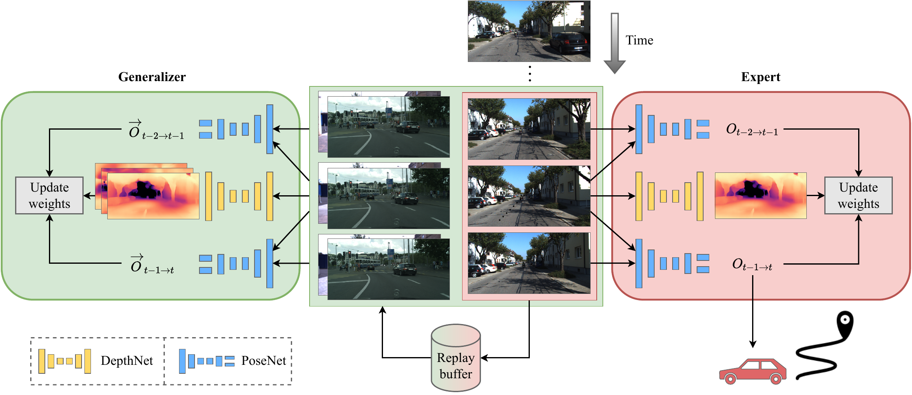

# Continual SLAM
[**arXiv**](https://arxiv.org/abs/2203.01578) | [**website**](http://continual-slam.cs.uni-freiburg.de/)

This repository is the official implementation of the paper:

> **Continual SLAM: Beyond Lifelong Simultaneous Localization and Mapping through Continual Learning**
>
> [Niclas Vödisch](https://vniclas.github.io/), [Daniele Cattaneo](https://rl.uni-freiburg.de/people/cattaneo), [Wolfram Burgard](http://www2.informatik.uni-freiburg.de/~burgard/), and [Abhinav Valada](https://rl.uni-freiburg.de/people/valada).
>
> *arXiv preprint arXiv:2203.01578*, 2022

<p align="center">
  
</p>

If you find our work useful, please consider citing our paper:
```
@article{voedisch2022continual,
  title={Continual SLAM: Beyond Lifelong Simultaneous Localization and Mapping through Continual Learning},
  author={V{\"o}disch, Niclas and Cattaneo, Daniele and Burgard, Wolfram and Valada, Abhinav},
  journal={arXiv preprint arXiv:2203.01578},
  year={2022}
}
```

## 📔 Abstract

While lifelong SLAM addresses the capability of a robot to adapt to changes within a single environment over time, in this paper we introduce the task of continual SLAM.
Here, a robot is deployed sequentially in a variety of different environments and has to transfer its knowledge of previously experienced environments to thus far unseen environments, while avoiding catastrophic forgetting.
This is particularly relevant in the context of vision-based approaches, where the relevant features vary widely between different environments.
We propose a novel approach for solving the continual SLAM problem by introducing CL-SLAM.
Our approach consists of a dual-network architecture that handles both short-term adaptation and long-term memory retention by incorporating a replay buffer.
Extensive evaluations of CL-SLAM in three different environments demonstrate that it outperforms several baselines inspired by existing continual learning-based visual odometry methods.


## 👨‍💻 Code Release

We will make the code publicly accessible upon acceptance of our paper.


## 👩‍⚖️ License

For academic usage, the code is released under the [GPLv3](https://www.gnu.org/licenses/gpl-3.0.en.html) license.
For any commercial purpose, please contact the authors.
