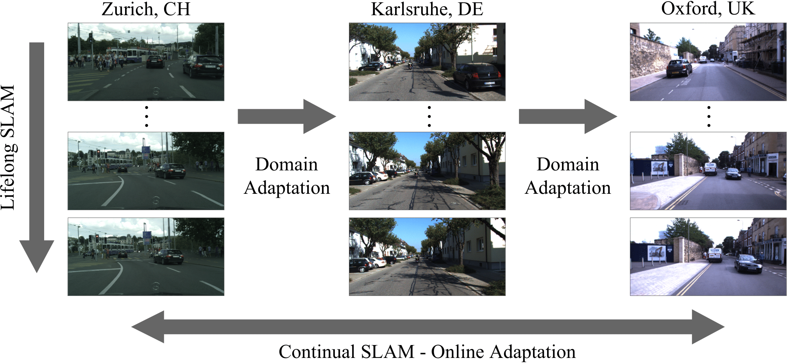

# Continual SLAM
[**Website**](http://continual-slam.cs.uni-freiburg.de/)

This repository is the official implementation of the papers **Continual SLAM** and **CoVIO**:

[**arXiv**](https://arxiv.org/abs/2203.01578) | [**Springer**](https://link.springer.com/chapter/10.1007/978-3-031-25555-7_3) | [**Video**](https://youtu.be/ASEzwnV4vNk)
> **Continual SLAM: Beyond Lifelong Simultaneous Localization and Mapping through Continual Learning** <br>
> [Niclas Vödisch](https://vniclas.github.io/), [Daniele Cattaneo](https://rl.uni-freiburg.de/people/cattaneo), [Wolfram Burgard](http://www2.informatik.uni-freiburg.de/~burgard/), and [Abhinav Valada](https://rl.uni-freiburg.de/people/valada). <br>
> *International Symposium on Robotics Research (ISRR)*, 2022

[**arXiv**](https://arxiv.org/abs/2303.10149) | [**IEEE Xplore**](https://ieeexplore.ieee.org/document/10209029)
> **CoVIO: Online Continual Learning for Visual-Inertial Odometry** <br>
> [Niclas Vödisch](https://vniclas.github.io/), [Daniele Cattaneo](https://rl.uni-freiburg.de/people/cattaneo), [Wolfram Burgard](http://www2.informatik.uni-freiburg.de/~burgard/), and [Abhinav Valada](https://rl.uni-freiburg.de/people/valada). <br>
> *IEEE/CVF Conference on Computer Vision and Pattern Recognition (CVPR) Workshops*, 2023

<p align="center">
  
</p>

If you find our work useful, please consider citing our papers:
```
@InProceedings{voedisch2023clslam,
  author="V{\"o}disch, Niclas and Cattaneo, Daniele and Burgard, Wolfram and Valada, Abhinav",
  editor="Billard, Aude and Asfour, Tamim and Khatib, Oussama",
  title="Continual SLAM: Beyond Lifelong Simultaneous Localization and Mapping Through Continual Learning",
  booktitle="Robotics Research",
  year="2023",
  publisher="Springer Nature Switzerland",
  address="Cham",
  pages="19--35",
}
```

```
@article{voedisch2023covio,
  title="CoVIO: Online Continual Learning for Visual-Inertial Odometry",
  author="V{\"o}disch, Niclas and Cattaneo, Daniele and Burgard, Wolfram and Valada, Abhinav",
  journal="IEEE/CVF Conference on Computer Vision and Pattern Recognition (CVPR) Workshops",
  year="2023"
}
```

<a href="https://github.com/opendr-eu/opendr"></a><br>
CL-SLAM and CoVIO are also featured in the [OpenDR toolkit](https://github.com/opendr-eu/opendr).

## 📔 Abstract

### Continual SLAM
While lifelong SLAM addresses the capability of a robot to adapt to changes within a single environment over time, in this paper we introduce the task of continual SLAM.
Here, a robot is deployed sequentially in a variety of different environments and has to transfer its knowledge of previously experienced environments to thus far unseen environments, while avoiding catastrophic forgetting.
This is particularly relevant in the context of vision-based approaches, where the relevant features vary widely between different environments.
We propose a novel approach for solving the continual SLAM problem by introducing CL-SLAM.
Our approach consists of a dual-network architecture that handles both short-term adaptation and long-term memory retention by incorporating a replay buffer.
Extensive evaluations of CL-SLAM in three different environments demonstrate that it outperforms several baselines inspired by existing continual learning-based visual odometry methods.

### CoVIO
Visual odometry is a fundamental task for many applications on mobile devices and robotic platforms.
Since such applications are oftentimes not limited to predefined target domains and learning-based vision systems are known to generalize poorly to unseen environments, methods for continual adaptation during inference time are of significant interest.
In this work, we introduce CoVIO for online continual learning of visual-inertial odometry.
CoVIO effectively adapts to new domains while mitigating catastrophic forgetting by exploiting experience replay.
In particular, we propose a novel sampling strategy to maximize image diversity in a fixed-size replay buffer that targets the limited storage capacity of embedded devices.
We further provide an asynchronous version that decouples the odometry estimation from the network weight update step enabling continuous inference in real time.
We extensively evaluate CoVIO on various real-world datasets demonstrating that it successfully adapts to new domains while outperforming previous methods.

# 🏗 Setup

Clone repository: `git clone --recurse-submodules https://github.com/robot-learning-freiburg/CL-SLAM.git`

## ⚙️ Installation
- Create conda environment: `conda create --name continual_slam python=3.8`
- Activate conda environment: `conda activate continual_slam`
- Install dependencies: `pip install -r requirements.txt`
- For smooth development, install git hook scripts: `pre-commit install`

## 🔄 Install [g2opy](https://github.com/uoip/g2opy)
We use g2o for pose graph optimization.
- Apply fixes for Eigen version >= 3.3.5: `./third_party/fix_g2opy.py`
- Install C++ requirements:
  - `conda install cmake`
  - `conda install -c conda-forge eigen`
  - `conda install -c conda-forge suitesparse`
- Install g2opy:
```
cd third_party/g2opy
mkdir build
cd build
cmake -DPYBIND11_PYTHON_VERSION=3.8 ..
make -j8        |NOTE: reduce number if running out of memory
cd ..
|NOTE: remove any .so file which is not for Python 3.8
python setup.py install  |NOTE: Ensure that the conda environment is active
```

## 💾 Data preparation
To re-train or run the experiments from our paper, please download and pre-process the respective datasets.

### Cityscapes
Download the following files from https://www.cityscapes-dataset.com/downloads/:
- `leftImg8bit_sequence_trainvaltest.zip` (324GB)
- `timestamp_sequence.zip` (40MB)
- `vehicle_sequence.zip` (56MB)
- `disparity_sequence_trainvaltest.zip` (106GB) (optionally, used for computing the depth error)

### Oxford RobotCar
Download the RTK ground truth from https://robotcar-dataset.robots.ox.ac.uk/ground_truth/ (91MB).
<br>Download the camera models from https://robotcar-dataset.robots.ox.ac.uk/downloads/ (129MB).
<br>We used the files from https://robotcar-dataset.robots.ox.ac.uk/datasets/2015-08-12-15-04-18/:
- `2015-08-12-15-04-18_stereo_centre_01.tar`, `...0*.tar` (25GB)
- `2015-08-12-15-04-18_gps.tar` (20MB)

Undistort the center images:
```python
python datasets/robotcar.py <IMG_PATH> <MODELS_PATH>
```

### KITTI
Download the KITTI Odometry data from http://www.cvlibs.net/datasets/kitti/eval_odometry.php:
- `odometry data set (color, 65 GB)`
- `odometry ground truth poses (4 MB)`

Download the KITTI raw data from http://www.cvlibs.net/datasets/kitti/raw_data.php for the runs specified in [`datasets/kitti.py`](datasets/kitti.py) (search for `KITTI_RAW_SEQ_MAPPING`).
- `[synced+rectified data]`

Download the ground truth depth from http://www.cvlibs.net/datasets/kitti/eval_depth_all.php (optionally, used for computing the depth error).
- `annotated depth maps data set (14GB)`

Extract the raw data matching the odometry dataset. Note that sequence 03 is excluded as no IMU data (KITTI raw) has been released.
```python
python datasets/kitti.py <RAW_PATH> <ODOMETRY_PATH> --oxts
python datasets/kitti.py <GT_DEPTH_PATH> <ODOMETRY_PATH> --depth
```


# 🏃 Running the Code

## 🏋 Pre-training
We pre-trained CL-SLAM on the Cityscapes Dataset.
You can either download the resulting weights, where we masked potentially dynamic objects, or pre-train the DepthNet and PoseNet by yourself by running our code.
**Note** that you have to adjust the `dataset_path` in [`config/config_pretrain.yaml`](config/config_pretrain.yaml).
```python
python main_pretrain.py
```
Model weights: https://drive.google.com/file/d/1M3I_C3f4JWGLlLaeiyT8-QqoM4GctCw3/view?usp=sharing (Please unzip the file after download.)


## 🗺️ Adaptation with CL-SLAM
For adaptation, we used the KITTI Odometry Dataset and the Oxford RobotCar Dataset.
The experiments in the paper are conducted on the KITTI sequences 09 and 10 as well as on two RobotCar sequences.
<br>In order to fill the replay buffer with the pre-training data, please run the following script after having adjusted the paths in the file.
This can take some time.
```python
python make_cityscapes_buffer.py
```
In the configuration file [`config/config_adapt.yaml`](config/config_adapt.yaml), please adjust the following parameters:
- `Dataset.dataset` --> Set either `Kitti` or `RobotCar`
- `Dataset.dataset_path` --> Set the path to the data
- `DepthPosePrediction.load_weights_folder` --> Should be the path to the weights from pre-training or the previous adaptation
- `Slam.dataset_sequence` --> Set the KITTI sequence, or `1` or `2` for RobotCar
- `Slam.logging` --> If this is set to true, make sure to enable dataloaders in the [`slam/slam.py`](slam/slam.py) have `with_depths` argument set to `True`, also make sure that you have `gt_depth` in your dataset folder

Then run:
```python
python main_adapt.py
```

## 📒 Notes

### Continual SLAM
The originally released code for *Continual SLAM*, i.e., without the extensions of *CoVIO*, can be found under commit [4ac27f6](https://github.com/robot-learning-freiburg/CL-SLAM/tree/4ac27f62478cb8301f73bb294be07b846235fe6a).

### CoVIO
The asynchronous variant is provided in the [OpenDR toolkit](https://github.com/opendr-eu/opendr).


## 👩‍⚖️ License

For academic usage, the code is released under the [GPLv3](https://www.gnu.org/licenses/gpl-3.0.en.html) license.
For any commercial purpose, please contact the authors.


## 🙏 Acknowledgment

This work was funded by the European Union’s Horizon 2020 research and innovation program under grant agreement No 871449-OpenDR.
<br><br>
<a href="https://opendr.eu/"></a>
